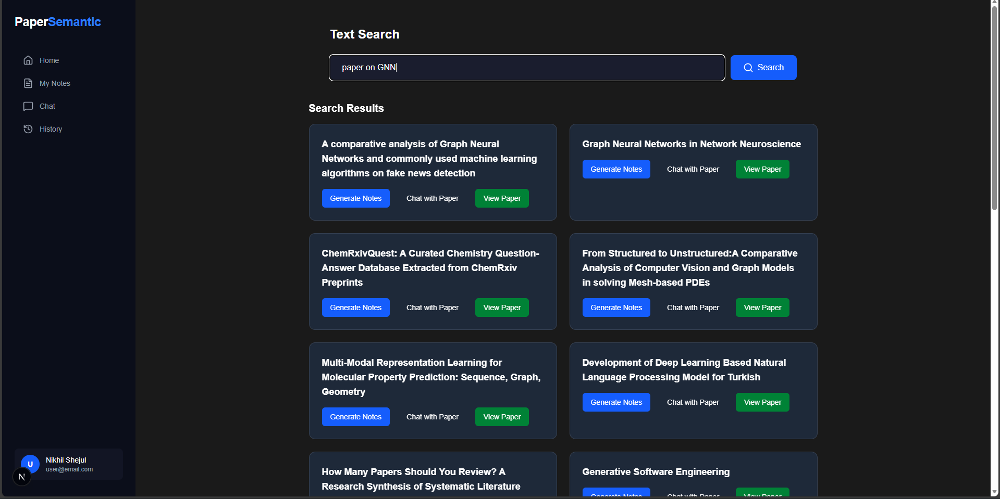
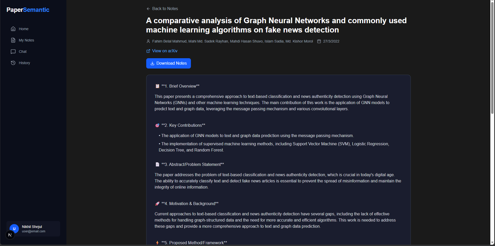
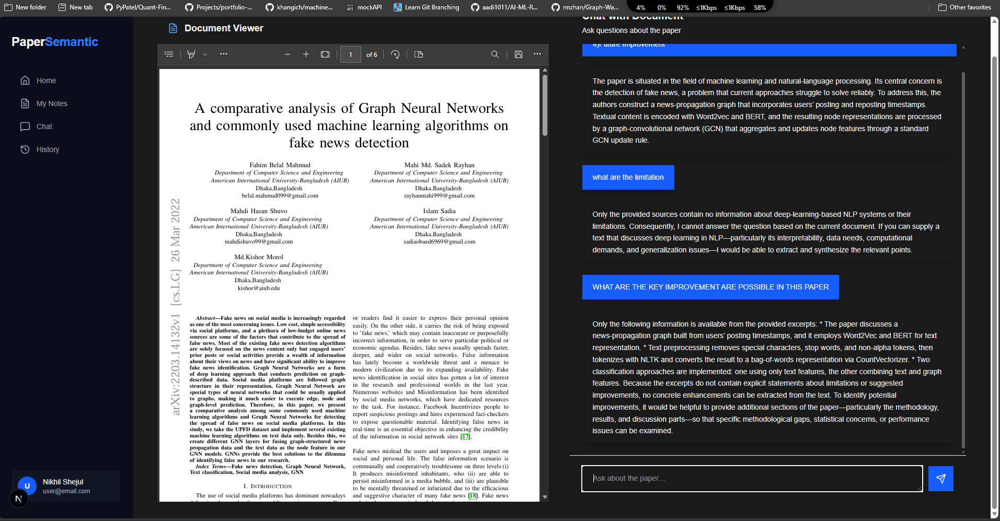

# PaperSemantic - AI-Powered Research Paper Platform

<div align="center">


**Semantic search, AI-generated notes, and interactive chat for 35,000+ research papers**

[Live Demo](#) • [Documentation](#features) • [Report Bug](#) • [Request Feature](#)

</div>

---

## 🌟 Overview

PaperSemantic is an AI-powered platform that revolutionizes how researchers interact with academic papers. Using advanced semantic search, automated note generation, and RAG-based chat functionality, it helps researchers quickly find, understand, and analyze research papers from arXiv.

### ✨ Key Features

- 🔍 **Multi-Modal Search** - Search by text, images, or upload PDFs to find similar papers
- 📝 **AI Notes Generation** - Automatically generate structured summaries with key points, methods, and results
- 💬 **Chat with Papers** - Ask questions and get contextual answers from specific research papers
- 🎯 **Semantic Understanding** - Vector-based search across 35,000+ papers from 7 major fields
- 🌙 **Modern UI** - Clean, responsive dark-themed interface built with Next.js and Tailwind CSS

---

## 🚀 Demo

### Search Interface


### Notes Generation


### Chat with Papers


---

## 🛠️ Tech Stack

### Backend
- **Framework:** FastAPI (Python 3.11+)
- **Vector Database:** Qdrant
- **Embeddings:** Sentence Transformers
- **LLM:** Groq API / HuggingFace Models
- **PDF Processing:** PyMuPDF, pdfplumber
- **OCR:** EasyOCR + BLIP for image understanding

### Frontend
- **Framework:** Next.js 15 (App Router)
- **Styling:** Tailwind CSS
- **UI Components:** Lucide Icons
- **State Management:** React Hooks
- **API Integration:** Native Fetch API

### Data Processing
- **Papers Indexed:** 35,000+ from arXiv
- **Fields Covered:** Computer Science, Engineering, Biology, Mathematics, Physics, Chemistry
- **Embedding Model:** all-MiniLM-L6-v2 / all-mpnet-base-v2

---

## 📁 Project Structure
```
PaperSemantic/
│
├── Backend/                    # FastAPI backend
│   ├── chat/                   # RAG-based chat functionality
│   │   ├── chat.py            # Chat logic
│   │   └── start_chat_pipeline.py
│   │
│   ├── embedding/              # Embedding generation
│   │   └── embedd.py
│   │
│   ├── ingestion/              # PDF text extraction
│   │   └── extraction.py
│   │
│   ├── notes/                  # Notes generation pipeline
│   │   ├── text/              # Text processing & summarization
│   │   │   ├── extractor.py
│   │   │   ├── summarizer.py
│   │   │   └── model.py
│   │   └── Visual/            # Image/table extraction
│   │       ├── image_table_extractor.py
│   │       └── visual_summary.py
│   │
│   ├── routes/                 # API endpoints
│   │   └── search.py
│   │
│   ├── search/                 # Search service
│   │   └── service.py
│   │
│   └── main.py                 # FastAPI app entry point
│
├── frontend/                   # Next.js frontend
│   └── src/
│       ├── app/
│       │   ├── api/           # Next.js API routes
│       │   │   ├── chat/      # Chat endpoints
│       │   │   ├── notes/     # Notes endpoints
│       │   │   ├── search_text/
│       │   │   └── upload/
│       │   │
│       │   ├── Home/          # Main dashboard
│       │   │   ├── components/
│       │   │   │   ├── SearchBar.jsx
│       │   │   │   ├── SearchResults.jsx
│       │   │   │   ├── UploadPanel.jsx
│       │   │   │   └── Sidebar.jsx
│       │   │   ├── notes/     # Notes pages
│       │   │   ├── chat/      # Chat pages
│       │   │   └── page.jsx   # Dashboard home
│       │   │
│       │   └── page.js        # Landing page
│       │
│       ├── components/         # Shared components
│       │   └── ui/
│       │
│       └── lib/               # Utilities
│           └── api_call.js
│
├── data/                       # Research papers data
│   ├── metadata/              # Paper metadata (JSON)
│   └── raw_pdfs/              # PDF storage
│
└── embeddings/                 # Vector embeddings
    ├── chunks/                # Text chunks
    └── model/                 # Embedding models
        ├── embedding.py
        ├── vector.py
        └── page_filter.py
```

---

## ⚙️ Installation & Setup

### Prerequisites

- Python 3.11+
- Node.js 18+
- Qdrant (running locally or cloud)
- Git

### 1. Clone the Repository
```bash
git clone https://github.com/yourusername/papersemantic.git
cd papersemantic
```

### 2. Backend Setup
```bash
cd Backend

# Create virtual environment
python -m venv venv
source venv/bin/activate  # On Windows: venv\Scripts\activate

# Install dependencies
pip install -r requirements.txt

# Set environment variables
cp .env.example .env
# Edit .env with your API keys:
# - GROQ_API_KEY
# - QDRANT_URL
# - QDRANT_API_KEY

# Run the backend
uvicorn main:app --reload --host 0.0.0.0 --port 8000
```

Backend will be available at `http://localhost:8000`

### 3. Frontend Setup
```bash
cd frontend

# Install dependencies
npm install

# Set environment variables
cp .env.local.example .env.local
# Edit .env.local:
# NEXT_PUBLIC_API_URL=http://localhost:8000

# Run development server
npm run dev
```

Frontend will be available at `http://localhost:3000`

### 4. Initial Data Setup
```bash
# Generate embeddings for papers (one-time setup)
cd Backend
python -m embedding.embedd

# This will:
# 1. Load papers from data/metadata/
# 2. Generate embeddings
# 3. Store in Qdrant vector database
```

---

## 🎯 Usage

### 1. **Text Search**
- Navigate to dashboard
- Enter keywords or research topics
- View semantically similar papers
- Click "Generate Notes" or "Chat with Paper"

### 2. **Image Search**
- Upload an image (diagram, chart, screenshot)
- System uses OCR + BLIP to understand content
- Returns relevant papers based on visual content

### 3. **PDF Upload**
- Upload a research paper PDF
- System extracts metadata and content
- Finds similar papers in the database

### 4. **Generate Notes**
- Click "Generate Notes" on any paper
- AI processes text + visual elements
- Creates structured summary with:
  - Key points and takeaways
  - Methodology overview
  - Results and findings
  - Limitations and future work

### 5. **Chat with Paper**
- Open chat for any paper
- Ask questions about methodology, results, etc.
- Get contextual answers using RAG
- System retrieves relevant sections before answering

---

## 🔑 Key Features Explained

### Semantic Search Engine

Uses vector embeddings and Qdrant for semantic similarity:
```python
# Search flow:
User Query → Embedding → Vector Search → Top-K Papers → Rerank → Results
```

- **Hybrid Search:** Combines vector similarity with keyword matching
- **Multi-field Coverage:** 7 academic fields with 500+ papers each
- **Fast Retrieval:** <2 second response time

### AI Notes Generation

Two-level processing pipeline:
```python
# Notes generation flow:
PDF → Text Extraction → Visual Extraction → 
LLM Summarization (Text) → LLM Summarization (Visual) → 
Combine & Structure → Formatted Notes
```

- **Text Processing:** Extracts and summarizes main content
- **Visual Processing:** Analyzes figures, tables, and charts
- **Structured Output:** Organized with sections and emojis

### RAG-Based Chat

Retrieval-Augmented Generation for accurate responses:
```python
# Chat flow:
User Question → Retrieve Relevant Chunks → 
Build Context → LLM Response → Stream to Frontend
```

- **Context-Aware:** Uses actual paper content
- **Citation Support:** References specific sections
- **Streaming Responses:** Real-time answer generation

## Future Improvemnt

-- Enhancing The Quality of The Results for all three section Search, Notes and Chat
-- Deployement for Backend and Frontend
-- Adding User Authentication
-- Caching for ChatBot

---
